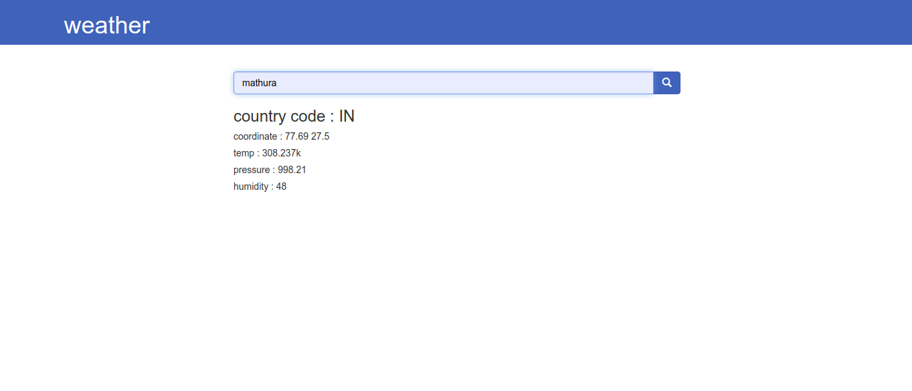

# weather-flask

Flask is a lightweight framework written in Python. It is lightweight because it does not require particular tools or libraries and allow rapid web development. today we will create a weather app using flask as a web framework. this weather web app will provide current weather updates of cities searched.

learn how to make <a href="https://www.geeksforgeeks.org/create-a-weather-app-using-flask-python/" target="_blank">GeeksforGeeks</a>

